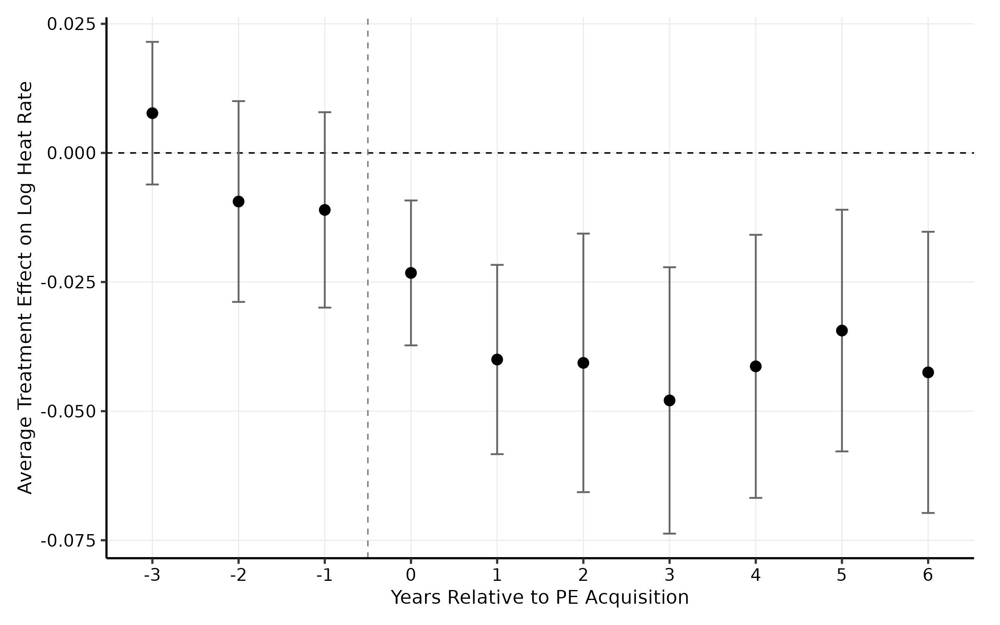
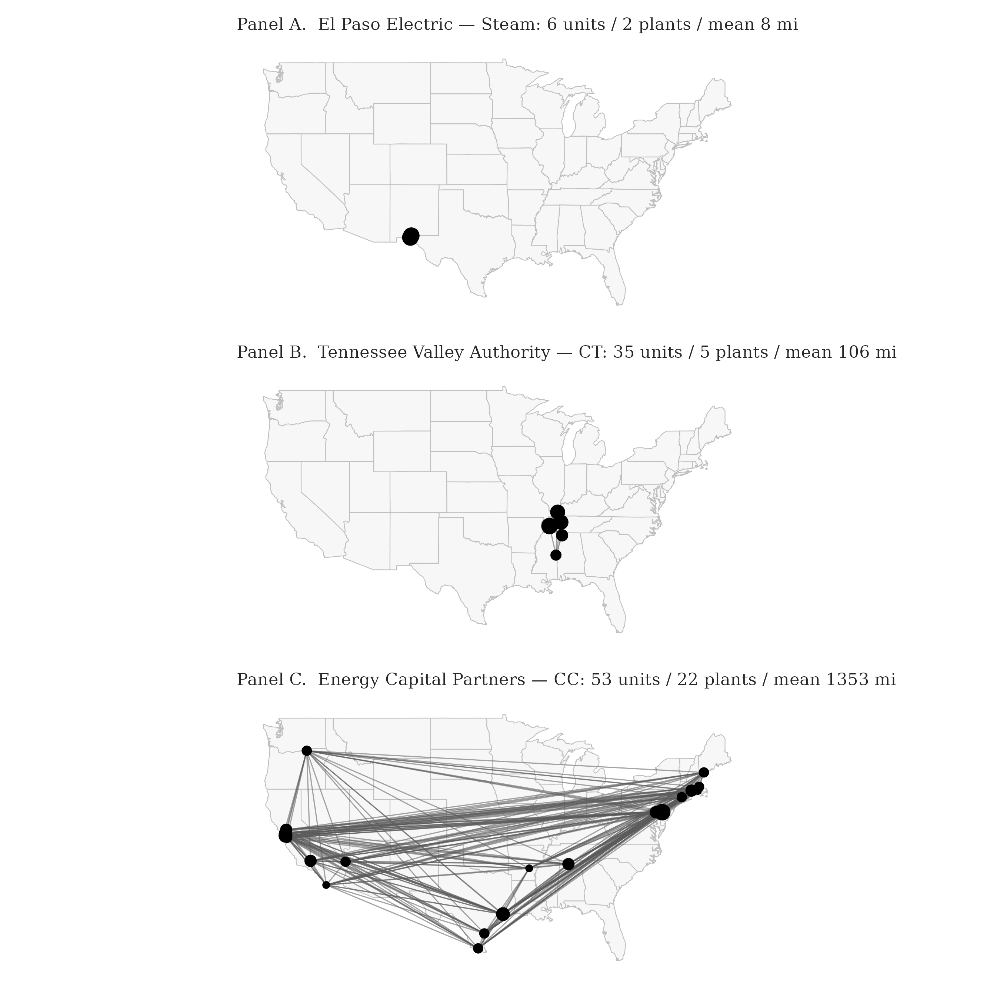

# Strategic Focus and Private Equity Performance: Evidence from U.S. Power Generation

**Doctoral job market paper, 2026–2027**
*Haiyang Zhang · Doctoral Candidate in Strategy, Harvard Business School*

---

## Why it matters now

AI scaling now hits two binding constraints: **advanced compute** and **electricity**. On the compute side, frontier AI accelerators (Nvidia's H100/H200/Blackwell GPUs, AMD's MI300, Google's TPUs) depend on high-bandwidth memory (HBM) supplied by SK Hynix, Samsung, and Micron, and on CoWoS advanced packaging at TSMC — supply expansion in both extends through at least 2028. On the electricity side, the PJM capacity-market auction cleared at $269.92/MW-day in 2025/26, up from $28.92 the year before — a near 10× shock driven explicitly by data-center demand.

Compute and electricity are complements, not substitutes: a chip without power is idle silicon. Who owns and operates the existing fossil fleet — and how efficiently they run it — will shape both AI's capacity ramp and the climate trajectory of the transition. This paper identifies private equity as the ownership form distinctively positioned to deliver productivity gains across the geographic scale of the U.S. grid, and the organizational mechanism that makes that possible.

---

## What this paper finds

Private equity owners of U.S. power-generating assets deliver **roughly 3–5% improvements in unit-level energy efficiency** in the six years following acquisition (point estimates settle near 4% across most of the post-period; longer horizons approach 5%). The gains translate to roughly **$270–$620 million per year in avoided fuel costs** and **5.8 million tons of CO₂ avoided annually** (≈1.3 million cars off the road).

This identifies **technological similarity, not geographic proximity**, as the operative channel of strategic focus — separating the mechanism cleanly from classical agglomeration economics (Marshall, Glaeser, Saxenian) and pointing to private equity's distinctive capability to deliver productivity gains across long geographic distance.

*Dynamic average treatment effect on log heat rate for PE-acquired units, ±6 years around acquisition; Callaway & Sant'Anna (2021) staggered DiD with not-yet-treated controls. Pre-trends are flat; the efficiency premium accumulates over the post-period.*

*Three real parent firms at different scales of within-portfolio same-technology dispersion. Panel A (El Paso Electric, ~8 miles) shows a regulated utility with co-located plants; Panel B (Tennessee Valley Authority, ~106 miles) shows a regional federal utility; Panel C (Energy Capital Partners, ~1,350 miles) shows an energy-focused PE firm whose combined-cycle plants span the Eastern interconnection. The paper finds the productivity gains concentrate in the third pattern, not the first.*

---

## Status

Manuscript is in active revision. Conference and workshop presentations forthcoming. **The current draft is available upon request.**

---

## Contact

**Haiyang Zhang**
Doctoral Candidate in Strategy
Harvard Business School
hzhang@hbs.edu

[@haiyzhang](https://github.com/haiyzhang)
